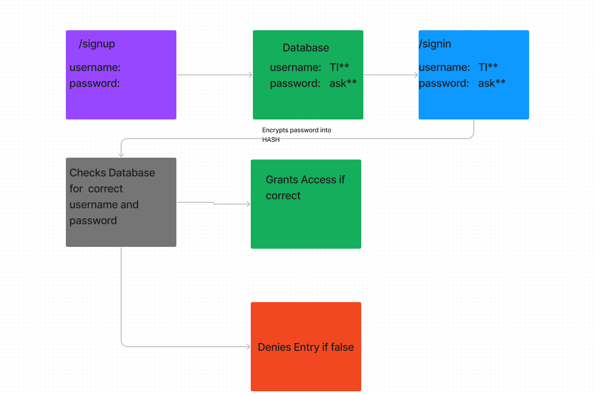

# basic-auth

LAB - 06
Authentication

Author: Jonathan Brooks

[Pull Request](https://github.com/jonbrooks01/basic-auth/pull/3)

[deployed server](https://basic-auth-cpgb.onrender.com)

Setup
.env requirements:PORT - 3000

Running the app: npm start

Endpoint: Returns Object

<!-- {
  "domain": "deployment-practice-main.onrender.com/",
  "status": "{name: name}",
 "port":
} -->
Tests
Unit Tests: npm run test
<!-- Lint Tests: npm run lint -->

UML:

